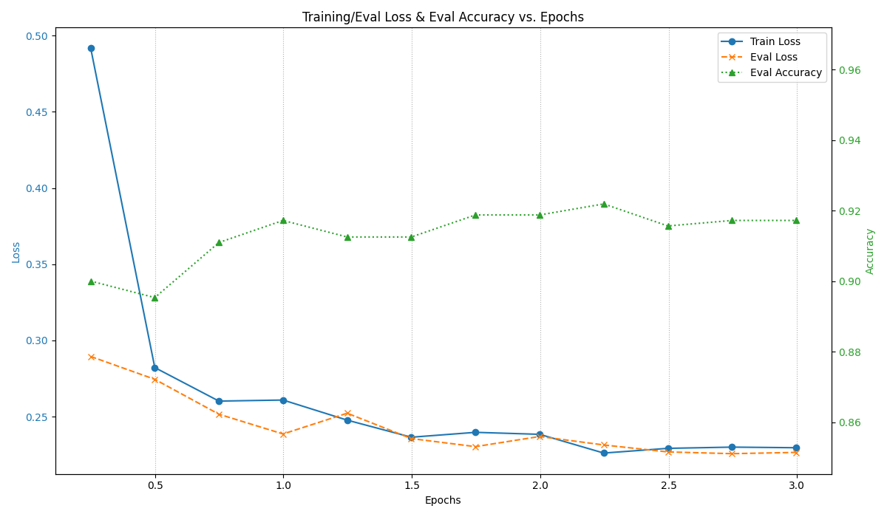
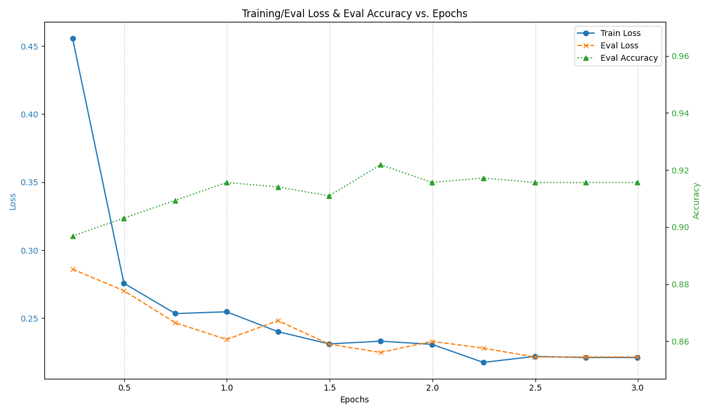

# Project 2: BERT Fine-tuning for Text Classification

## Team Members
Yukang Luo (yl13427@nyu.edu), Zhilin Zhang (zz10068@nyu.edu), Yumeng Qian (yq2480@nyu.edu).

## Kaggle Final Score Notice
The final score of our Kaggle submission can be reproduced by running:
```Shell
python main.py --peft_method adalora --output_dir results_adalora_qvd_r6-4_a2_1e-4 --target_modules query value attention.output.dense --lora_r 4 --adalora_init_r 6  --lora_alpha 2 --adalora_tinit 0 --adalora_tfinal 0 --adalora_deltaT 1 --adalora_beta1 0.85 --adalora_beta2 0.85 --lora_dropout 0.1 --num_train_epochs 4 --learning_rate 1e-4
```
and take the prediction from 2nd epoch (i.e., `epoch2_predictions.csv` under `final_kaggle_model`).

## Usage
1. Clone the repo:
```Shell
git clone https://github.com/Hadlay-Zhang/RoBERTa-LoRA-Finetuning.git
```

2. Prepare venv environment
```Shell
python -m venv env
source env/bin/activate
cd RoBERTa-LoRA-Finetuning
pip install -r requirements.txt
```

3. Training and Evaluation
```Shell
# LoRA
python main.py --peft_method lora --output_dir results_lora_qv_r8_a16_lr2e-4 --target_modules query value --lora_r 8 --lora_alpha 16 --lora_dropout 0.1 --num_train_epochs 3 --learning_rate 2e-4
# LoHa
python main.py --peft_method loha --output_dir results_loha_qv_r4_a8_lr2e-4 --target_modules query value --lora_r 4 --lora_alpha 8 --lora_dropout 0.1 --num_train_epochs 3 --learning_rate 2e-4
# LoKr
python main.py --peft_method lokr --output_dir results_lokr_qkv_r8_a24_lr2e-4 --target_modules query value key --lora_r 8 --lora_alpha 24 --lora_dropout 0.1 --num_train_epochs 3 --learning_rate 2e-4
# AdaLoRA
python main.py --peft_method adalora --output_dir results_adalora_qvd_r6-4_a2_lr2e-4 --target_modules query value attention.output.dense --lora_r 4 --adalora_init_r 6  --lora_alpha 2 --adalora_tinit 0 --adalora_tfinal 0 --adalora_deltaT 1 --adalora_beta1 0.85 --adalora_beta2 0.85 --lora_dropout 0.1 --num_train_epochs 3 --learning_rate 2e-4
```

4. Inference
```Shell
python infer.py --model_dir /path/to/checkpoint --output_csv /path/to/save_dir/prediction.csv --batch_size 128
```

This will produce the predicted .csv file to the 'output_csv'.  

## Training and Evaluation Plots

### Comparison of different adaptors

1. LoRA


2. AdaLoRA


3. LoKr


4. LoHa


### Ablation Study of Rank and Alpha

#### Fix r=8, compare different alpha

1. r=8, alpha=4


2. r=8, alpha=8


3. r=8, alpha=16


4. r=8, alpha=32


#### Fix alpha=16, compare different alpha

1. r=2, alpha=16


2. r=4, alpha=16


3. r=8, alpha=16


## Possible Issues

### 1. RuntimeError: Failed to find C compiler. Please specify via CC environment variable.

Run following instruction to fix:
```Shell
sudo apt-get update && sudo apt-get install build-essential
```
